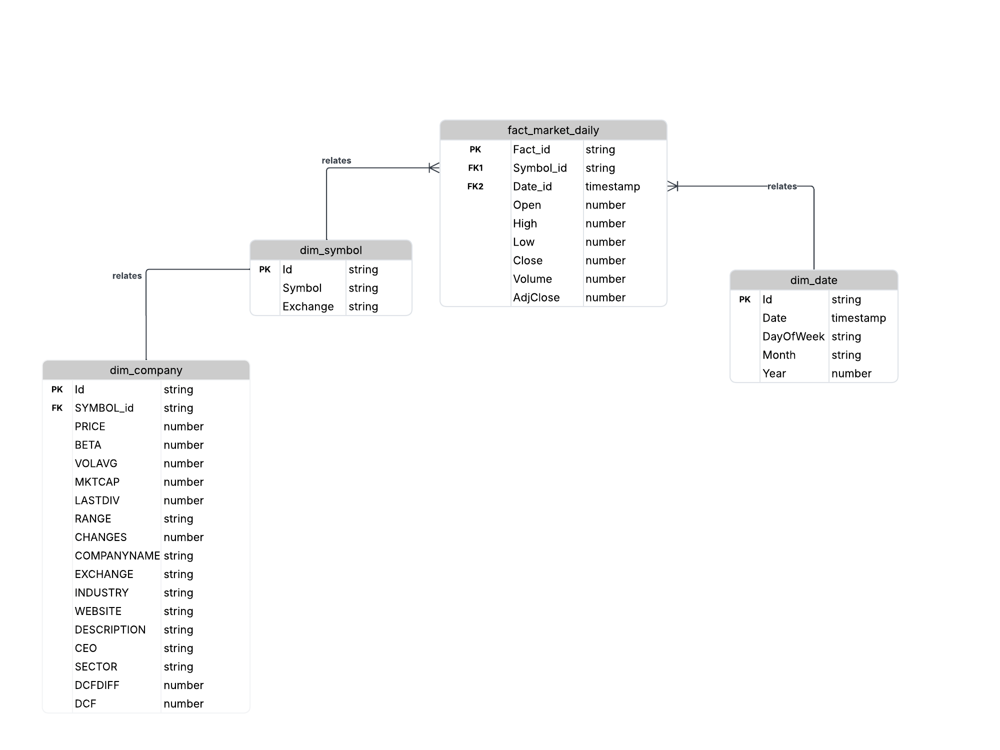

# Airflow ETL Pipeline

This repository contains an Airflow-based ETL pipeline that extracts, transforms, and loads stock market data into Snowflake.  
It includes automated DAGs, validation scripts, and schema definitions for `dim_company`, `dim_symbol`, `dim_date`, and `fact_market_daily`.

---

## ER Diagram

  

